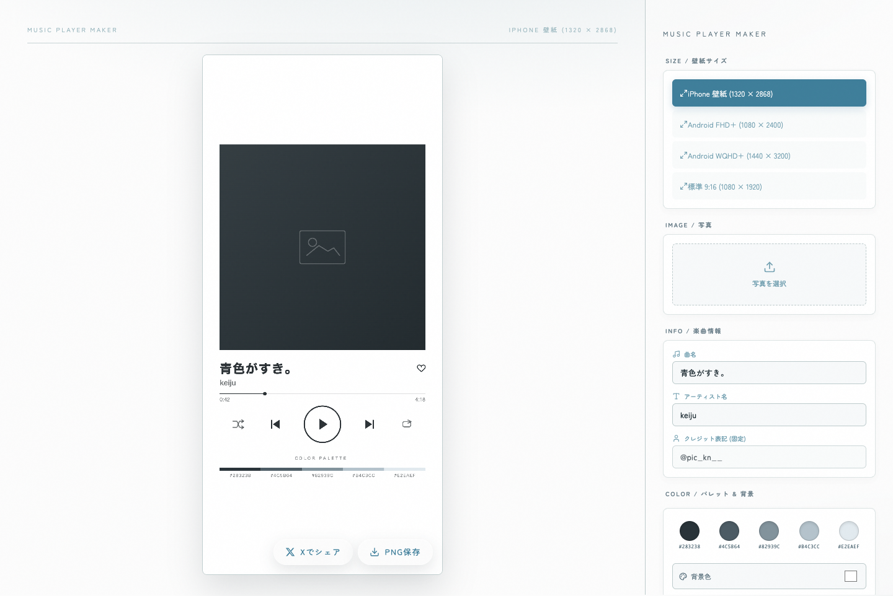

# Music Player Maker 🎵

お気に入りの写真と好きな楽曲タイトル・アーティスト名を組み合わせて、スタイリッシュな**音楽プレイヤー風スマホ壁紙画像（PNG）**を制作できるWebアプリケーションです。



---

## ✨ 主な機能・特徴

1. **色抽出アルゴリズム (`color-memo` 互換)**
   - 写真をアップロードすると、自動的に画像から調和の取れた 5 色のカラーパレットを抽出し、キャンバス上に美しく一覧描画します。

2. **スポイト機能 (Eyedropper Mode)**
   - 写真の好きな位置をクリック・タップすることで、その地点を中心としたカラーをピンポイントで再抽出できます。「解除する」を押すまで連続して何度でも色を試せます。

3. **白背景（#FFFFFF）初期搭載 & 自動文字色コントラスト**
   - 清潔感のある白背景が初期選択されており、背景色の明るさに応じてメイン文字・操作アイコンが自動で見やすいカラー（濃いグレー `#2C3236` / 薄いグレー `#EDF1F3`）へ調整されます。

4. **マルチアスペクト比 & スマホ壁紙サイズ対応**
   - `iPhone 壁紙 (1320 × 2868)`
   - `Android FHD+ (1080 × 2400)`
   - `Android WQHD+ (1440 × 3200)`
   - `標準 9:16 (1080 × 1920)`
   - 画面アスペクト比が変わっても、画像や文字が歪んだり押しつぶされることなく自然に最適描画されます。

5. **こだわり抜いたタイポグラフィとプレイヤー表示**
   - 筑紫A丸ゴシックおよび丸ゴシックフォントによる柔らかいタイポグラフィ。
   - 楽曲タイトルの文字間隔（3px）やパレット下HEXコードの文字間隔（2px）など細部まで美しいレイアウト。
   - 左右完全対称なハートマーク (♡) や、Spotifyスタイルの再生・シャッフル・リピートアイコン。
   - 固定クレジット表記 `@pic_kn__` の自動印字。

6. **ワンタップ PNG 保存 & X (Twitter) 共有**
   - 制作した高解像度壁紙をワンクリックで高精細 PNG 保存。
   - ワンタップで X (Twitter) にサイトを投稿・共有可能。

---

## 🛠 使用技術

- **フロントエンド**: Next.js 15 (App Router), React 19
- **スタイリング**: Vanilla CSS (CSS Variables, Flexbox/Grid Layout)
- **描画エンジン**: HTML5 Canvas 2D Context API
- **アイコン**: Lucide React
- **色抽出アルゴリズム**: MMCQ (Median Cut Quantization) + Dominant Hue Filter (pure JS)

---

## 🚀 ローカルでの開発・起動手順

```bash
# 依存パッケージのインストール
npm install

# 開発サーバー起動
npm run dev

# ブラウザで開く
http://localhost:3000
```

---

## 📦 GitHub Pages へのデプロイ方法

本プロジェクトは `output: 'export'` を設定済みのため、以下のコマンドで一発で GitHub Pages に静的ビルド＆デプロイが完了します。

```bash
npm run deploy
```

---

## ✒️ クレジット

Designed & Created by **@pic_kn__**
